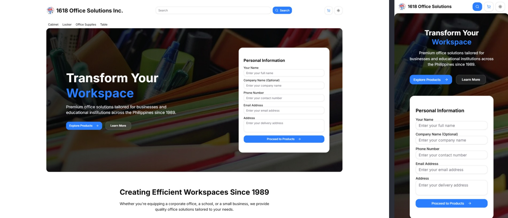

# E-Commerce Website for 1618 Office Solutions



This is an **E-Commerce Website with Sales Prediction** using **GRU-Based Neural Networks** powered by [Brain.js](https://brain.js.org/). The platform enables customers to purchase office hardware, furniture, and supplies from **1618 Office Warehouse**, featuring secure checkout options.

## Features

- User registration and login with role-based access (customer/admin)
- Product catalog with advanced filters (category, brand, price, etc.)
- Email notifications for order confirmation and updates using Nodemailer
- Admin dashboard for product, customer, and order management
- Real-time product availability
- Sales and customer analytics with predictive insights using historical sales data
- Bulk order support for office supplies
- Wishlist functionality for saving preferred products

## Tech Stack

- **Frontend**:
  - React 19
  - [Shadcn/UI](https://ui.shadcn.com) components for modern UI
  - Tailwind CSS for styling
  - React Router for navigation
  - Recharts for data visualization
- **Backend**:
  - Node.js with Express.js
  - GRU-based sales prediction using [Brain.js](https://brain.js.org/) for historical sales analysis and next-sequence forecasting
  - RESTful API architecture
  - Nodemailer for email notifications
  - Heroku Postgres for database hosting
  - Heroku Scheduler for automated tasks
  - Cloudinary for image management
- **Database**:
  - PostgreSQL

## Setup

### Prerequisites

- Node.js (v14 or higher)
- npm
- Backend server running (refer to the backend setup guide)

### Installation

1. Clone the repository:
   ```bash
   git clone <repository-url>
   cd e-commerce-sales-prediction-frontend
   ```

2. Install dependencies:
   ```bash
   npm install
   ```

3. Create a `.env` file in the root directory and configure the following environment variables:
   ```bash
   VITE_API_URL=youripaddress
   ```

4. Start the development server:
   ```bash
   npm start
   ```

5. Open your browser and navigate to `http://localhost:3000`.

### Build for Production

To build the project for production, run:
```bash
npm run build
```

The production-ready files will be available in the `build/` directory.

### Deployment

1. Deploy the `build/` directory to a static hosting service like Netlify, Vercel, or AWS S3.
2. Ensure the backend API is accessible from the deployed frontend.
